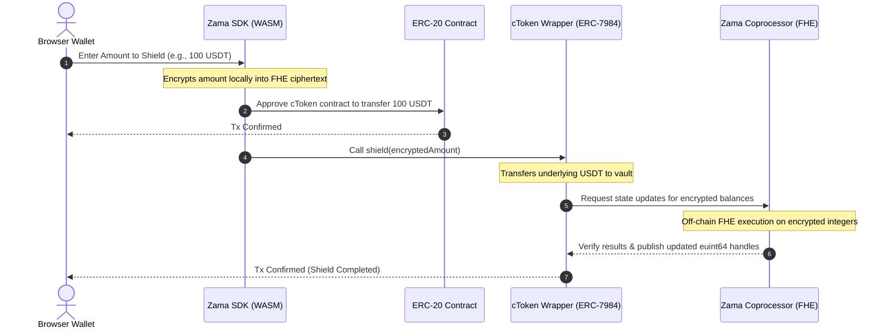
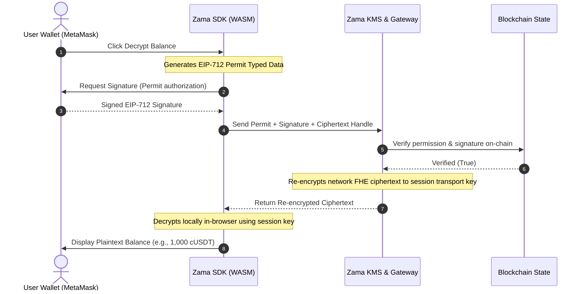

# ZamaVault — Confidential Asset Shielding Protocol

[](https://github.com/hosein-ul/zamavault)
[](https://nextjs.org/)
[](https://docs.zama.org/protocol)
[](https://www.typescriptlang.org/)
[](LICENSE)

ZamaVault is an enterprise-grade, non-custodial decentralized application (dApp) that acts as the primary gateway for Zama's FHEVM Wrappers Registry. Built entirely on Fully Homomorphic Encryption (FHE), ZamaVault enables users and institutions to seamlessly shield standard ERC-20 tokens into ERC-7984 confidential tokens (cTokens) and perform private on-chain asset transfers.

With ZamaVault, transaction amounts and token balances remain completely encrypted on the blockchain, computable only in their encrypted state, while sender and receiver identities are preserved for ledger auditing.

---

## Table of Contents

- [1. About ZamaVault](#1-about-zamavault)
- [2. Supported Networks](#2-supported-networks)
- [3. Core Features Deep Dive](#3-core-features-deep-dive)
- [4. Technical Architecture & Data Flows](#4-technical-architecture--data-flows)
  - [4.1 FHE Shielding Flow (Public to Confidential)](#41-fhe-shielding-flow-public-to-confidential)
  - [4.2 FHE Decryption Flow (Confidential to Plaintext)](#42-fhe-decryption-flow-confidential-to-plaintext)
- [5. Security & Cryptographic Trust Model](#5-security--cryptographic-trust-model)
- [6. Hybrid Registry Sourcing Strategy](#6-hybrid-registry-sourcing-strategy)
- [7. B2B & Enterprise Use Cases](#7-b2b--enterprise-use-cases)
- [8. How to Configure a New Token Pair](#8-how-to-configure-a-new-token-pair)
- [9. Local Development & Setup](#9-local-development--setup)
- [10. Repository Structure](#10-repository-structure)
- [11. License](#11-license)

---

## 1. About ZamaVault

Traditional blockchain networks expose all transaction values and account balances to public block explorers, posing significant security and privacy risks for both retail users and commercial enterprises. ZamaVault addresses this challenge by utilizing Torus Fully Homomorphic Encryption (TFHE) on-chain via Zama's FHEVM. 

It wraps public ERC-20 tokens into **ERC-7984 Confidential Wrappers** (cTokens), converting open balance data into cryptographic ciphertext handles (`euint64`). Transactions and balances are processed on-chain in their encrypted state, ensuring confidentiality while maintaining decentralized validation.

---

## 2. Supported Networks

ZamaVault supports the following network configurations:

| Network | Chain ID | RPC Endpoint | Contract Registry Address |
|---|---|---|---|
| **Ethereum Sepolia** | 11155111 | Public / Infura / Alchemy | `0x2f0750Bbb0A246059d80e94c454586a7F27a128e` |
| **Ethereum Mainnet** | 1 | Public / Infura | `0xeb5015fF021DB115aCe010f23F55C2591059bBA0` |

*Note: Confidential operations (Shield, Unshield, Decrypt, and Faucet claims) are actively supported on the Ethereum Sepolia Testnet.*

---

## 3. Core Features Deep Dive

ZamaVault is divided into specialized modules tailored for retail and enterprise confidentiality management:

### 3.1 Registry Browser (`/app`)
Displays a live list of registered public-to-confidential token pairs fetched directly from the on-chain registry contract.
* **On-Chain Sync:** Syncs contract metadata, validation states, and pair registry entries in real-time.
* **Revocation Status:** Automatically marks revoked token pairs as inactive, disabling wrapping actions and providing alerts.
* **Custom Indicators:** Visually distinguishes local configuration pairs from official on-chain pairs.

### 3.2 Shielding & Unshielding Engine (`/app/wrap`)
Facilitates the conversion between public assets (ERC-20) and confidential assets (ERC-7984 cTokens).
* **WASM FHE Encryption:** Automatically encrypts the inputs locally in the browser before submitting the transaction to the network.
* **Multi-Step Status Tracking:** Provides real-time visual progress across transaction states: Approval, Shielding, and On-Chain Confirmation.
* **Smart Route Optimization:** Dynamically switches between the 1-transaction path (using ERC-1363 `transferAndCall`) and the 2-transaction path (using standard `approve` + `shield`) based on the target token's features.

### 3.3 Portfolio Manager & Decrypter (`/app/portfolio`)
A dashboard displaying all user balance details. Balances remain securely locked and hidden by default.
* **Batch Decryption:** Leverages EIP-712 permits to batch-decrypt all registry balances simultaneously, reducing user interaction overhead.
* **Arbitrary Token Scanner:** Allows developers to input any ERC-7984 contract address. ZamaVault scans the address, queries metadata, and adds it to the user's dashboard.
* **My Recent Activity:** A personal ledger displaying historical transactions (shields, unwraps, faucet claims) made by the active wallet.

### 3.4 DeFi Analytics Dashboard (`/app/analytics`)
Provides protocol-wide analytics and transaction metrics.
* **Total Value Shielded (TVS):** Displays live protocol statistics on wrapped assets, calculations, and pool metrics.
* **Global Activity Stream:** Displays a live-updating transaction history of all wrapping events occurring across the registry.

### 3.5 Token Faucet (`/app/faucet`)
An integrated faucet allowing developers to claim testnet mock tokens to experiment with FHE capabilities.
* **Single-Click Minting:** Requests public tokens (`USDT`, `USDC`, `WETH`, `BRON`) and automatically initiates shielding.
* **Interactive Guides:** Linked directly to the onboarding tutorials.

### 3.6 Onboarding Center (`/app/learn`)
An interactive, step-by-step onboarding tutorial designed to guide users through the FHE lifecycle:
1. **Wallet Connection:** Connecting to Ethereum Sepolia.
2. **Faucet Claims:** Minting mock testnet tokens.
3. **Asset Shielding:** Converting public tokens to cTokens.
4. **Balance Decryption:** Executing EIP-712 signature prompts.
5. **Asset Unshielding:** Restoring public balances.

### 3.7 Developer Tools & ABI Explorer (`/app/developers`)
A developer sandbox containing technical resources for custom integrations:
* **Interactive ABI Explorer:** Read and query functions of ERC-20 and ERC-7984 contracts directly.
* **SDK Integration Code Generator:** Explains hooks like `useShield`, `useUnshield`, and `useConfidentialBalance` with copy-pasteable React snippets.

### 3.8 Docs Hub (`/app/docs`)
An in-app documentation portal explaining technical architecture, decimal scaling rules, and EIP-712 permit verification processes.

---

## 4. Technical Architecture & Data Flows

ZamaVault's architecture decouples public blockchain logic, local cryptographic calculations, and decentralized key management:

```
┌────────────────────────────────────────────────────────┐
│             Browser UI (Next.js / React)               │
└──────────────────────────┬─────────────────────────────┘
                           │
      ┌────────────────────┴────────────────────┐
      ▼                                         ▼
┌───────────┐                             ┌───────────┐
│  Wagmi &  │                             │ Zama React│
│   Viem    │                             │    SDK    │
└─────┬─────┘                             └─────┬─────┘
      │                                         │ (WASM FHEVM library)
      │                                         ▼
      │                                  ┌─────────────┐
      │                                  │ Local WASM  │
      │                                  │ Cryptography│
      │                                  └──────┬──────┘
      │                                         │
      ▼                                         ▼
┌───────────────────────────────────────────────────────┐
│                 Ethereum Sepolia / FHEVM              │
│  ┌────────────────────────┐ ┌──────────────────────┐  │
│  │ WrappersRegistry       │ │ cToken Wrapper       │  │
│  └────────────────────────┘ └──────────────────────┘  │
└───────────────────────────────────┬───────────────────┘
                                    │
                                    ▼
                        ┌──────────────────────┐
                        │    Zama KMS / GW     │
                        └──────────────────────┘
```

### 4.1 FHE Shielding Flow (Public to Confidential)

The diagram below illustrates the process of shielding public ERC-20 tokens into encrypted cTokens:



### 4.2 FHE Decryption Flow (Confidential to Plaintext)

To query and view confidential balances, ZamaVault uses EIP-712 permits. The process prevents gas consumption and ensures the plaintext is only visible to the user:



---

## 5. Security & Cryptographic Trust Model

ZamaVault's privacy architecture relies on the following security properties:

* **Lattice-Based Cryptography:** FHE is built on Ring Learning With Errors (LWE) lattice assumptions, which are mathematically recognized as secure against quantum computer attacks.
* **Session Key Decryption:** Plaintext values are never transmitted across the network or stored on servers. Decryption occurs strictly inside the local browser context using ephemeral session keys.
* **EIP-712 Permit Scoping:** Permit signatures are read-only and restricted to balance views. They cannot approve token transfers, withdraw funds, or modify contract states.
* **Zero-Knowledge KMS Boundaries:** The Key Management System (KMS) re-encrypts FHE ciphertexts from the network key to the user's session key. This cryptographic handshake ensures that neither the KMS gateway nor any relayer can inspect the user's plaintext values.

---

## 6. Hybrid Registry Sourcing Strategy

To guarantee uptime and developer flexibility, ZamaVault merges token information from three layers:

```
┌────────────────────────────────────────────────────────┐
│                 ZamaVault Client                       │
├────────────────────────────────────────────────────────┤
│ 1. Reads On-Chain WrappersRegistry                     │
│ 2. Merges local JSON snapshot (Disconnect Fallback)    │
│ 3. Appends custom developer tokens (custom-pairs.ts)   │
│ 4. Applies de-duplication rules                        │
└────────────────────────────────────────────────────────┘
```

1. **Layer 1: On-Chain WrappersRegistry (Canonical Source)**
   Reads official token pairs directly from the Zama WrappersRegistry contract on Ethereum Sepolia or Mainnet. This is the canonical source of truth.
2. **Layer 2: Local Snapshot Fallback (`src/config/contracts.ts`)**
   If the user's wallet is disconnected or the RPC connection fails, ZamaVault falls back to a local JSON snapshot of known wrappers. This allows visitors to browse the catalog offline.
3. **Layer 3: Local Custom Configuration (`src/config/custom-pairs.ts`)**
   Allows developers to add custom token wrappers (e.g., local development pairs or tokens awaiting official registration) by adding them to a local configuration file.
   * **De-duplication Logic:** If a custom token pair is subsequently registered on-chain, ZamaVault automatically prioritizes the canonical on-chain record and drops the local duplicate.

---

## 7. B2B & Enterprise Use Cases

Confidential ERC-7984 wrapper standard implementations enable several corporate use cases:

* **Confidential Corporate Payroll:** Allows companies to pay salaries, consulting fees, and bonuses in stablecoins (e.g., cUSDC) on public ledgers without exposing employee compensation details or monthly payroll figures.
* **OTC Trading & Institutional Dark Pools:** Enables institutions to execute block trades and OTC swaps privately. Keeping trade sizes and token balances encrypted during settlement prevents front-running and visible order books.
* **Private Treasury Reserves:** Allows corporations to manage reserve assets, yield farming positions, and inter-company financing on-chain without exposing strategic financial positioning to competitors.

---

## 8. How to Configure a New Token Pair

Developers can register custom wrappers immediately without submitting on-chain governance proposals.

### Step 1: Open the configuration file
Edit the custom pairs file: [`src/config/custom-pairs.ts`](file:///C:/Users/hashe/Documents/antigravity/adventurous-lavoisier/src/config/custom-pairs.ts)

### Step 2: Add your contract details
Insert an entry into the `CUSTOM_PAIRS` array:

```typescript
import type { CustomPair } from '@/config/contracts';

export const CUSTOM_PAIRS: CustomPair[] = [
  {
    erc20Address:    '0xYourERC20TokenAddress',    // Public underlying token
    erc7984Address:  '0xYourERC7984WrapperAddress', // Confidential wrapper contract
    symbol:          'MYT',
    name:            'My Test Token',
    decimals:        18,                           // Decimals of public token
    wrapperDecimals: 6,                            // Decimals of confidential token (typically 6)
    source:          'custom',
    note:            'Deployed for local staging — awaiting on-chain registration',
  },
];
```

### Step 3: Run the local build
Run the development server. The custom pair will immediately populate across all interface modules (Registry, Wrap/Unwrap dropdowns, Portfolio Decrypter).

*Note: The target `erc7984Address` must implement the ERC-165 interface standard and return `true` for interface ID `0x4958f2a4`.*

---

## 9. Local Development & Setup

### Prerequisites
* **Node.js:** v18.17.0 or higher
* **Package Manager:** npm / yarn

### Installation

```bash
# Clone the repository
git clone https://github.com/hosein-ul/zamavault.git
cd zamavault

# Install dependencies
npm install
```

### Running the Application

```bash
# Run the Next.js Turbopack development server
npm run dev
```
Open `http://localhost:3000` to interact with the application.

### Compilation & Build Verification

```bash
# Run TypeScript compilation checks
npx tsc --noEmit

# Compile production bundle
npm run build
```

---

## 10. Repository Structure

```
src/
├── app/
│   ├── page.tsx               # Landing Page (Scrollytelling)
│   └── app/
│       ├── page.tsx           # Registry Catalog Browser
│       ├── wrap/              # Wrapping & Shielding Panel
│       ├── portfolio/         # Portfolio Decryption & Local Activity Feed
│       ├── faucet/            # Claim cTokenMocks
│       ├── analytics/         # Protocol Analytics & Global Stream
│       ├── learn/             # Interactive User Onboarding Guide
│       ├── developers/        # ABI Explorer & SDK Code Generator
│       └── docs/              # In-App Architecture Docs
├── config/
│   ├── contracts.ts           # Registry ABIs and known snapshots
│   ├── custom-pairs.ts        # Custom developer pairs configuration
│   ├── chains.ts              # Blockchain networks
│   └── tokens.ts              # Token logos and configuration
├── lib/
│   ├── registry.ts            # Hybrid merge and de-duplication rules
│   ├── wrapper-abi.ts         # Wrapper and ERC-20 ABIs
│   ├── errors.ts              # Transaction error handlers
│   └── utils.ts               # Formatting utilities
└── components/                # Shared layout and UI components
```

---

## 11. License

This project is licensed under the **MIT License**. See the `LICENSE` file for details.
