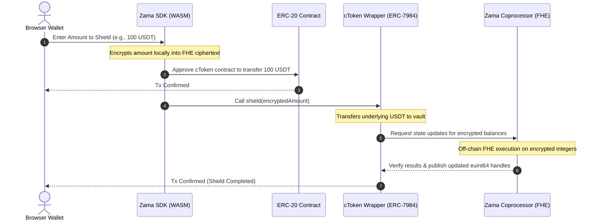
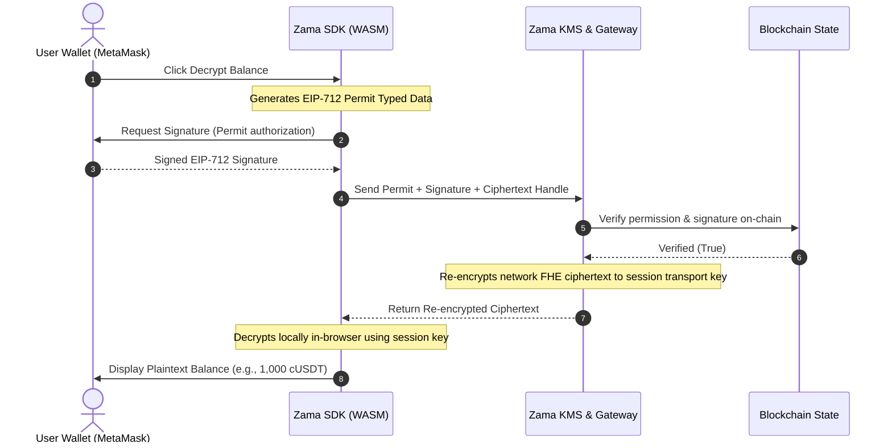

# ShadowLine — Confidential Asset Shielding Protocol

[](https://github.com/hosein-ul/ShadowLine)
[](https://nextjs.org/)
[](https://docs.zama.org/protocol)
[](https://www.typescriptlang.org/)
[](LICENSE)

ShadowLine is a non-custodial dApp built on top of Zama's Confidential
Token Wrappers Registry, powered by Zama's FHEVM. It lets you shield
ERC-20 tokens into ERC-7984 confidential tokens (cTokens), unshield them
back, and send confidential transfers with encrypted amounts.

Beyond wrapping, ShadowLine includes user decryption of your own balances,
a browsable token registry with custom-token support, a portfolio view,
and a testnet faucet — across Sepolia and coming soon on Ethereum mainnet.

Because balances and transfer amounts are handled as ERC-7984 confidential tokens, they stay encrypted on-chain and are computed in their encrypted state via FHE. Wallet addresses remain public on-chain, as with any standard transaction.


---

## Table of Contents

- [1. About ShadowLine](#1-about-shadowline)
- [2. Supported Networks](#2-supported-networks)
- [3. Core Features Deep Dive](#3-core-features-deep-dive)
- [4. Technical Architecture & Data Flows](#4-technical-architecture--data-flows)
  - [4.1 FHE Shielding Flow (Public to Confidential)](#41-fhe-shielding-flow-public-to-confidential)
  - [4.2 FHE Decryption Flow (Confidential to Plaintext)](#42-fhe-decryption-flow-confidential-to-plaintext)
- [5. Security & Cryptographic Trust Model](#5-security--cryptographic-trust-model)
- [6. Hybrid Registry Sourcing Strategy](#6-hybrid-registry-sourcing-strategy)
- [7. B2B & Enterprise Use Cases](#7-b2b--enterprise-use-cases)
- [8. How to Configure a New Token Pair](#8-how-to-configure-a-new-token-pair)
- [9. Local Development & Setup](#9-local-development--setup)
- [10. Repository Structure](#10-repository-structure)
- [11. Zama SDK 3.0.1 — methods used](#11-zama-sdk-301--methods-used)
- [12. FAQ: Why doesn't Decrypt ask for signature on some tokens?](#12-faq-why-doesnt-decrypt-ask-for-signature-on-some-tokens)
- [13. License](#13-license)

---


## 1. About ShadowLine

Traditional blockchain networks expose all transaction values and account balances to public block explorers, posing significant security and privacy risks for both retail users and commercial enterprises. ShadowLine addresses this challenge by using Fully Homomorphic Encryption (FHE) on-chain via Zama's FHEVM.

It wraps public ERC-20 tokens into **ERC-7984 Confidential Wrappers** (cTokens), converting open balance data into cryptographic ciphertext handles (`euint64`). Transactions and balances are processed on-chain in their encrypted state, ensuring confidentiality while maintaining decentralized validation.

---

## 2. Supported Networks

ShadowLine supports the following network configurations:

| Network | Chain ID | RPC Endpoint | Contract Registry Address |
|---|---|---|---|
| **Ethereum Sepolia** | 11155111 | Public / Infura / Alchemy | `0x2f0750Bbb0A246059d80e94c454586a7F27a128e` |
| **Ethereum Mainnet** | 1 | Public / Infura | `0xeb5015fF021DB115aCe010f23F55C2591059bBA0` |

*Note: Confidential operations (Shield, Unshield, Decrypt, and Faucet claims) are actively supported on the Ethereum Sepolia Testnet.*

---


## 3. Core Features Deep Dive

ShadowLine is divided into specialized modules tailored for retail and enterprise confidentiality management:

### 3.1 Registry Browser (`/app`)
Displays a live list of registered public-to-confidential token pairs fetched directly from the on-chain registry contract.
* **On-Chain Sync:** Syncs contract metadata, validation states, and pair registry entries in real-time.
* **Revocation Status:** Automatically marks revoked token pairs as inactive, disabling wrapping actions and providing alerts.
* **Custom Indicators:** Visually distinguishes local configuration pairs from official on-chain pairs.

### 3.2 Shielding & Unshielding Engine (`/app/wrap`)
Facilitates the conversion between public assets (ERC-20) and confidential assets (ERC-7984 cTokens).
* **WASM FHE Encryption:** Automatically encrypts the inputs locally in the browser before submitting the transaction to the network.
* **Multi-Step Status Tracking:** Provides real-time visual progress across transaction states: Approval, Shielding, and On-Chain Confirmation.
* **Smart Route Optimization:** Dynamically switches between the 1-transaction path (using ERC-1363 `transferAndCall`) and the 2-transaction path (using standard `approve` + `shield`) based on the target token's features.

### 3.3 Portfolio Manager & Decrypter (`/app/portfolio`)
A dashboard displaying all user balance details. Balances remain securely locked and hidden by default.
* **Batch Decryption:** Leverages EIP-712 permits to batch-decrypt all registry balances simultaneously, reducing user interaction overhead.
* **Arbitrary Token Scanner:** Allows developers to input any ERC-7984 contract address. ShadowLine scans the address, queries metadata, and adds it to the user's dashboard.
* **My Recent Activity:** A personal ledger displaying historical transactions (shields, unwraps, faucet claims) made by the active wallet.

### 3.4 DeFi Analytics Dashboard (`/app/analytics`)
Provides protocol-wide analytics and transaction metrics.
* **Total Value Shielded (TVS):** Displays live protocol statistics on wrapped assets, calculations, and pool metrics.
* **Global Activity Stream:** Displays a live-updating transaction history of all wrapping events occurring across the registry.

### 3.5 Token Faucet (`/app/faucet`)
An integrated faucet allowing developers to claim testnet mock tokens to experiment with FHE capabilities.
* **Single-Click Minting:** Requests public tokens (`USDT`, `USDC`, `WETH`, `BRON`) and automatically initiates shielding.
* **Interactive Guides:** Linked directly to the onboarding tutorials.

### 3.6 Onboarding Center (`/app/learn`)
An interactive, step-by-step onboarding tutorial designed to guide users through the FHE lifecycle:
1. **Wallet Connection:** Connecting to Ethereum Sepolia.
2. **Faucet Claims:** Minting mock testnet tokens.
3. **Asset Shielding:** Converting public tokens to cTokens.
4. **Balance Decryption:** Executing EIP-712 signature prompts.
5. **Asset Unshielding:** Restoring public balances.

### 3.7 Developer Tools & ABI Explorer (`/app/developers`)
A developer sandbox containing technical resources for custom integrations:
* **Interactive ABI Explorer:** Read and query functions of ERC-20 and ERC-7984 contracts directly.
* **SDK Integration Code Generator:** Explains hooks like `useShield`, `useUnshield`, and `useConfidentialBalance` with copy-pasteable React snippets.

### 3.8 Docs Hub (`/app/docs`)
An in-app documentation portal explaining technical architecture, decimal scaling rules, and EIP-712 permit verification processes.

---


## 4. Technical Architecture & Data Flows

ShadowLine's architecture decouples public blockchain logic, local cryptographic calculations, and decentralized key management:

```
┌────────────────────────────────────────────────────────┐
│             Browser UI (Next.js / React)               │
└──────────────────────────┬─────────────────────────────┘
                           │
      ┌────────────────────┴────────────────────┐
      ▼                                         ▼
┌───────────┐                             ┌───────────┐
│  Wagmi &  │                             │ Zama React│
│   Viem    │                             │    SDK    │
└─────┬─────┘                             └─────┬─────┘
      │                                         │ (WASM FHEVM library)
      │                                         ▼
      │                                  ┌─────────────┐
      │                                  │ Local WASM  │
      │                                  │ Cryptography│
      │                                  └──────┬──────┘
      │                                         │
      ▼                                         ▼
┌───────────────────────────────────────────────────────┐
│                 Ethereum Sepolia / FHEVM              │
│  ┌────────────────────────┐ ┌──────────────────────┐  │
│  │ WrappersRegistry       │ │ cToken Wrapper       │  │
│  └────────────────────────┘ └──────────────────────┘  │
└───────────────────────────────────┬───────────────────┘
                                    │
                                    ▼
                        ┌──────────────────────┐
                        │    Zama KMS / GW     │
                        └──────────────────────┘
```


### 4.1 FHE Shielding Flow (Public to Confidential)

The diagram below illustrates the process of shielding public ERC-20 tokens into encrypted cTokens:




### 4.2 FHE Decryption Flow (Confidential to Plaintext)

To query and view confidential balances, ShadowLine uses EIP-712 permits. The process prevents gas consumption and ensures the plaintext is only visible to the user:




---


## 5. Security & Cryptographic Trust Model

ShadowLine's privacy architecture relies on the following security properties:

* **Lattice-Based Cryptography:** FHE is built on Ring Learning With Errors (LWE) lattice assumptions, which are mathematically recognized as secure against quantum computer attacks.
* **Session Key Decryption:** Plaintext values are never transmitted across the network or stored on servers. Decryption occurs strictly inside the local browser context using ephemeral session keys.
* **EIP-712 Permit Scoping:** Permit signatures are read-only and restricted to balance views. They cannot approve token transfers, withdraw funds, or modify contract states.
* **Zero-Knowledge KMS Boundaries:** The Key Management System (KMS) re-encrypts FHE ciphertexts from the network key to the user's session key. This cryptographic handshake ensures that neither the KMS gateway nor any relayer can inspect the user's plaintext values.


---


## 6. Hybrid Registry Sourcing Strategy

To guarantee uptime and developer flexibility, ShadowLine merges token information from three layers:

```
┌────────────────────────────────────────────────────────┐
│                 ShadowLine Client                       │
├────────────────────────────────────────────────────────┤
│ 1. Reads On-Chain WrappersRegistry                     │
│ 2. Merges local JSON snapshot (Disconnect Fallback)    │
│ 3. Appends custom developer tokens (custom-pairs.ts)   │
│ 4. Applies de-duplication rules                        │
└────────────────────────────────────────────────────────┘
```

1. **Layer 1: On-Chain WrappersRegistry (Canonical Source)**
   Reads official token pairs directly from the Zama WrappersRegistry contract on Ethereum Sepolia or Mainnet. This is the canonical source of truth.
2. **Layer 2: Local Snapshot Fallback (`src/config/contracts.ts`)**
   If the user's wallet is disconnected or the RPC connection fails, ShadowLine falls back to a local JSON snapshot of known wrappers. This allows visitors to browse the catalog offline.
3. **Layer 3: Local Custom Configuration (`src/config/custom-pairs.ts`)**
   Allows developers to add custom token wrappers (e.g., local development pairs or tokens awaiting official registration) by adding them to a local configuration file.
   * **De-duplication Logic:** If a custom token pair is subsequently registered on-chain, ShadowLine automatically prioritizes the canonical on-chain record and drops the local duplicate.

---


## 7. B2B & Enterprise Use Cases

Confidential ERC-7984 wrapper standard implementations enable several corporate use cases:

* **Confidential Corporate Payroll:** Allows companies to pay salaries, consulting fees, and bonuses in stablecoins (e.g., cUSDC) on public ledgers without exposing employee compensation details or monthly payroll figures.
* **OTC Trading & Institutional Dark Pools:** Enables institutions to execute block trades and OTC swaps privately. Keeping trade sizes and token balances encrypted during settlement prevents front-running and visible order books.
* **Private Treasury Reserves:** Allows corporations to manage reserve assets, yield farming positions, and inter-company financing on-chain without exposing strategic financial positioning to competitors.

---


## 8. How to Configure a New Token Pair

Two paths, no on-chain governance required. Both flow the pair through the exact same shield / unshield / decrypt code paths as an Official registry pair — the only difference is which section lists it (**Official — Zama Registry** vs **Custom / Dev-only Tokens**).

The on-chain Wrappers Registry is permissioned and not publicly writable — its `registerConfidentialToken(erc20, wrapper)` entrypoint cannot be called by ShadowLine. So ShadowLine declares custom pairs **locally**: either seeded in the repo (path A, ships with the app) or added at runtime in the browser (path B, per-user).


Resolution order at read time: **on-chain registry (primary) → `CUSTOM_PAIRS` config → browser localStorage → hardcoded offline snapshot**. On-chain always wins on any address conflict.

### Path A — Seeded custom pair in the repo (persists across users)

**Step 1:** Open [`src/config/custom-pairs.ts`](src/config/custom-pairs.ts).

**Step 2:** Insert a `CustomPair` entry:

```ts
import type { CustomPair } from '@/config/contracts';

export const CUSTOM_PAIRS: CustomPair[] = [
  {
    erc20Address:    '0xYourERC20TokenAddress',    // public underlying
    erc7984Address:  '0xYourERC7984WrapperAddress', // confidential wrapper
    symbol:          'MYT',
    name:            'My Test Token',
    decimals:        18,                            // underlying decimals
    wrapperDecimals: 6,                             // wrapper decimals (FHE euint64 = 6)
    source:          'custom',
    note:            'Local staging pair — not registered on-chain yet.',
  },
];
```

**Step 3:** `npm run dev`. The pair appears everywhere immediately.

**Requirement:** `erc7984Address` must implement ERC-165 and return `true` for interface id `0x4958f2a4`. If it doesn't, ShadowLine's Add-Custom-Pair form rejects it — see path B.


### Path B — Add a pair from the UI (persists only in this browser)

**Step 1:** Open the dApp at `/app` and connect a wallet on the target network (Sepolia or Mainnet). The wallet is used for chain resolution — validation itself runs against a public RPC and doesn't require a signature.

**Step 2:** Scroll to the **Custom / Dev-only Tokens** section and paste the ERC-7984 wrapper address into the **ERC-7984 Wrapper Address** input.

**Step 3:** After ~500ms of debounce, the form runs the following checks against the on-chain wrapper. All must pass:
1. Address is a contract on the current chain (`getCode` non-empty).
2. `supportsInterface(0x4958f2a4)` returns `true`.
3. `underlying()` returns a non-zero address (fallback: legacy `underlyingToken()`).
4. Wrapper and underlying metadata (`name`, `symbol`, `decimals`) all read successfully.
5. Neither address collides with an existing on-chain registry pair, a config-file custom pair, an already-added local pair, or a scanner-detected token.
6. If the wrapper *is* in the on-chain registry with `isValid: true`, the form refuses to add a duplicate and tells the user "already Official"; if `isValid: false`, it rejects as "revoked".

On success, a green preview card appears — `Wrapper c<sym> ↔ Underlying <sym>` — with both addresses and decimals. Click **Add Pair**.

**Step 4:** The pair is persisted to `localStorage` under key `shadowline.customPairs.v1.<chainId>` (chain-scoped, not wallet-scoped — reconnecting a different wallet on the same chain keeps the list). It now shows under **Custom / Dev-only Tokens** and is immediately usable in Shield / Unshield / Decrypt / Transfer.

**Step 5 (optional):** Use the section's **Export** button to download your custom pairs as JSON, and **Import** to restore them — this survives a browser-cache wipe or moves the list to another machine.

### Worked example — using the "Restricted" ctGBP on Sepolia

Sepolia's on-chain registry contains a second, non-mintable `tGBP` wrapper deployed for real-money integration testing. It's already Official, so we use it here to demonstrate the *rejection* path: pasting it into the form should return a friendly "already Official" hint rather than silently adding a duplicate.

- **Wrapper (ERC-7984, `ctGBP`):** `0x167DC962808B32CFFFc7e14B5018c0bE06A3A208`
- **Underlying (ERC-20, `tGBP`):** `0xf6Ef9ADB61A48E29E36bc873070A46A3D2667ff3` — discovered on-chain via the wrapper's `underlying()`, no need to paste it.

(Both addresses read live from the Sepolia registry at `0x2f0750Bbb0A246059d80e94c454586a7F27a128e` via `getTokenConfidentialTokenPairsSlice`.)

1. Connect a wallet on Sepolia at `/app`.
2. Paste `0x167DC962808B32CFFFc7e14B5018c0bE06A3A208` into the Wrapper Address field.
3. After ~500ms, the form shows an info line: *"This pair is already Official (tGBP (Restricted)) — no need to add it."* — and the **Add Pair** button stays disabled.

To demonstrate the *success* path, deploy any ERC-7984 wrapper of your own on Sepolia, paste that wrapper address, and click **Add Pair** — the row will appear under **Custom / Dev-only Tokens** and route through the same shield/unshield/decrypt code paths as any official pair.


---


## 9. Local Development & Setup (0-to-100 DevOps Suite)

Want to run ShadowLine locally or deploy to a cloud node / VPS in under 1 minute? We built an automated, zero-friction **0-to-100 DevOps Wizard** that handles prerequisite checking (Git, Node.js v18+), environment configuration (`.env.local`), production build verification, and server launching.

### 🚀 1-Line Auto-Installers (with Automatic Prerequisite Installation)
If your system lacks Git or Node.js, these scripts automatically detect and install them in the background (via `apt-get`/NodeSource on Linux, `brew` on macOS, and `winget`/`choco` on Windows):

**Linux Ubuntu & macOS:**
```bash
curl -sSL https://raw.githubusercontent.com/hosein-ul/ShadowLine/main/scripts/setup.sh | bash
```

**Windows PowerShell:**
```powershell
irm https://raw.githubusercontent.com/hosein-ul/ShadowLine/main/scripts/setup.ps1 | iex
```

---

### 🛠️ Manual Clone & Setup Command by OS

**Linux Ubuntu & macOS (Bash / Zsh):**
```bash
git clone https://github.com/hosein-ul/ShadowLine.git && cd ShadowLine && npm run setup
```

**Windows (PowerShell & CMD):**
*(Note: Windows PowerShell does not use `&&`; use semicolons `;` as shown below)*
```powershell
git clone https://github.com/hosein-ul/ShadowLine.git; cd ShadowLine; npm run setup
```

---

### 🐳 Docker & VPS Self-Hosting
To spin up ShadowLine in an isolated container on an Ubuntu server or VPS:
```bash
docker compose up -d --build
```
Or via npm script alias:
```bash
npm run docker:up
```

---

### 📋 Manual Commands
If you prefer running individual commands manually:
```bash
# Install dependencies
npm install

# Run development server (Turbopack)
npm run dev

# Compile production bundle
npm run build

# Start production server
npm run start
```
Open `http://localhost:3000` to interact with the application.

**Live URL:** https://shadow-line.vercel.app/

---


## 10. Repository Structure

```
src/
├── app/
│   ├── page.tsx               # Landing Page (Scrollytelling)
│   └── app/
│       ├── page.tsx           # Registry Catalog Browser
│       ├── wrap/              # Wrapping & Shielding Panel
│       ├── portfolio/         # Portfolio Decryption & Local Activity Feed
│       ├── faucet/            # Claim cTokenMocks
│       ├── analytics/         # Protocol Analytics & Global Stream
│       ├── learn/             # Interactive User Onboarding Guide
│       └── docs/              # In-App Architecture Docs
├── config/
│   ├── contracts.ts           # Registry ABIs and known snapshots
│   ├── custom-pairs.ts        # Custom developer pairs configuration
│   ├── chains.ts              # Blockchain networks
│   └── tokens.ts              # Token logos and configuration
├── lib/
│   ├── registry.ts            # Hybrid merge and de-duplication rules
│   ├── wrapper-abi.ts         # Wrapper and ERC-20 ABIs
│   ├── errors.ts              # Transaction error handlers
│   └── utils.ts               # Formatting utilities
└── components/                # Shared layout and UI components
```

---


## 11. Zama SDK 3.0.1 — methods used

ShadowLine is pinned to `@zama-fhe/sdk` + `@zama-fhe/react-sdk` **3.0.1** (verified against installed `.d.ts`, which is treated as ground truth over the docs site). The build uses only what exists in that release:

| Purpose | Symbol | Package |
|---|---|---|
| List every registered wrapper pair | `getTokenConfidentialTokenPairsLength`, `getTokenConfidentialTokenPairsSlice` (direct viem read against the on-chain `WrappersRegistry`, wallet-free) | — |
| Discover a wrapper's underlying ERC-20 | `underlying()` (canonical) with `underlyingToken()` fallback for legacy wrappers | on-chain ABI |
| ERC-165 pre-flight for custom pairs | `ERC7984_INTERFACE_ID = 0x4958f2a4` + `supportsInterface` | `@zama-fhe/sdk` (exported), `WRAPPER_ABI`/`ERC165_ABI` |
| Shield ERC-20 → ERC-7984 | `useShield({ tokenAddress })` | `@zama-fhe/react-sdk` |
| Unshield (two-phase) | `useUnshield({ tokenAddress })`, `useResumeUnshield({ tokenAddress })`, `loadPendingUnshield`, `clearPendingUnshield`, `savePendingUnshield` | `@zama-fhe/react-sdk` / `@zama-fhe/sdk` |
| Single-balance decrypt | `useConfidentialBalance({ tokenAddress }, options)` | `@zama-fhe/react-sdk` |
| **Batch decrypt (one signature for many contracts)** | `useConfidentialBalances({ tokenAddresses }, options)` — used for `/app` **Decrypt All** and `/app/portfolio` batch reveal | `@zama-fhe/react-sdk` |
| Confidential transfer | `useConfidentialTransfer({ tokenAddress })` | `@zama-fhe/react-sdk` |
| SDK instance (storage, credentials) | `useZamaSDK` | `@zama-fhe/react-sdk` |
| Full FHE credential wipe (app-wide) | `sdk.credentials.clear()` (CredentialsManager → BaseCredentialsManager `clearAll`) — used by the header "Reset Decryption Session" button and the shared `SessionResetProvider` | `@zama-fhe/sdk` |
| Error classification | `matchZamaError` | `@zama-fhe/sdk` |

---

## 12. FAQ: Why doesn't Decrypt ask for signature on some tokens?

There are two legitimate reasons why the Decrypt action might not prompt you for a wallet signature:

1. **No balance yet** — If you've never received or wrapped this token, its confidential balance handle on-chain is `bytes32(0)`. The SDK recognizes this and returns `0` instantly without needing to sign or contact the relayer. There's no ciphertext to decrypt.
2. **Cached credentials** — After you sign once (via `useAllow`), an EIP-712 permit is stored in IndexedDB for up to 30 days. Any subsequent decrypt for a contract covered by that permit reuses the cached credential and skips the signature prompt.

Both behaviors follow Zama's official SDK guidance.

---

## 13. License

This project is licensed under the **MIT License**. See the `LICENSE` file for details.
