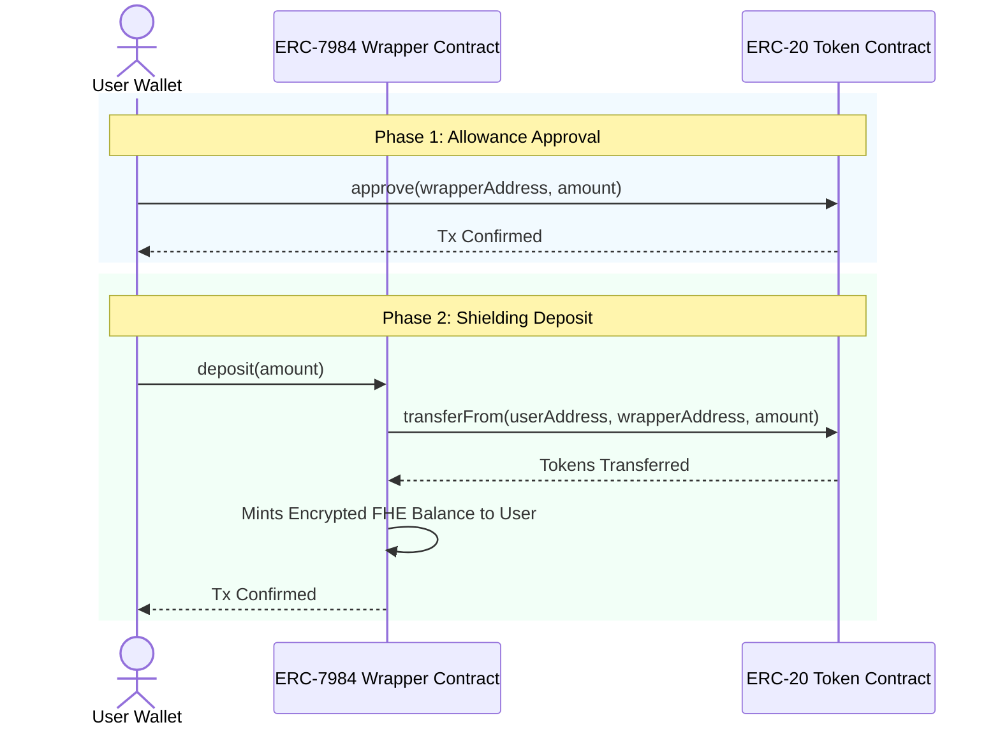

# ZamaVault — Token Wrapping Approval Flow Audit

This document provides a detailed audit and explanation of the signature and approval mechanism used during the token shielding (wrapping) process in **ZamaVault**.

---

## 🔍 The Wrapping (Shielding) Mechanism

When a user wraps (shields) a public ERC-20 token (e.g., USDT) into an encrypted ERC-7984 confidential token (e.g., cUSDT), the following sequence occurs:

---

## ❓ Frequently Asked Questions & Audit Findings

### 1. Why is the `approve` transaction required?
Under the **ERC-20 standard**, a smart contract (such as the Zama Wrapper) cannot arbitrarily pull tokens out of a user's wallet. To allow the wrapper contract to call `transferFrom` and transfer the public tokens into the vault, the user must explicitly submit an `approve` transaction. This is a fundamental security rule of the Ethereum Virtual Machine (EVM).

### 2. Can we use a signature instead of an on-chain `approve` transaction?
Some newer ERC-20 tokens support the **ERC-2612 standard**, which enables signature-based approvals (via `permit`). This allows the user to sign a message offline, and the wrapper contract submits that signature to perform the approval and deposit in a single transaction (saving gas and reducing wallet popups).

**However:**
- Standard **USDT** and **WETH** contracts deployed on Ethereum (and their mock testnet versions) **do not support ERC-2612 `permit`**.
- Because these tokens lack the `permit` function, they **must** use the traditional, on-chain `approve` transaction.

### 3. Why does the wallet display "Revoke approval" (approve to 0)?
In the OKX Wallet or MetaMask, when shielding USDT, you may see a transaction labeled **"Revoke approval"**. 

This is a specific security feature of the **USDT contract**:
- To prevent a known race-condition attack vector (front-running allowance changes), the USDT contract rejects any `approve(spender, new_value)` call if the current allowance is non-zero, unless `new_value` is `0`.
- To change the allowance, the Zama SDK (or any Web3 library) must first set the allowance to `0` (which wallets label as **"Revoke approval"**) and then call `approve` with the target amount.
- This creates two consecutive approval transactions if a prior non-zero allowance was detected.

---

## 🛠️ Optimizations Applied in ZamaVault

To make the wrapping flow as efficient as possible, ZamaVault implements the following rules:

1. **Allowance Cache Checking:** The UI reads `allowance` from the blockchain before prompting. If the user's current allowance is already greater than or equal to the wrap amount, the UI bypasses the approval phase entirely, going straight to the "Shield" transaction.
2. **Batch Decryption Permits:** Unlike shielding (which writes to the blockchain and requires gas/approvals), reading and decrypting confidential balances uses offline EIP-712 permits (`useConfidentialBalances`). These are purely cryptographic signatures, require **zero gas**, and are batched so the user only signs once to decrypt all assets.
